# Class 2021-06-12

- 前端工作介紹：範圍、工作類型、目標族群
- Javascript 發展歷史

  - [ES6 歷史](https://eyesofkids.gitbooks.io/javascript-start-from-es6/content/part1/history.html)
  - 語法部分

    

  - web api 部分

    

  - node.js

    

  - [Web APIs | MDN](https://developer.mozilla.org/zh-TW/docs/Web/API)
  - 革命性發展：XHR
  - WebRTC
    - <https://webrtc.org/>
  - 瀏覽器支援度
    - <https://html5test.com/>
  - 2015 年
  - 軟體發展趨勢，趨向敏捷
  - ES5 歷史背景，演進過程
  - [Javascript eingine](https://v8.dev/)
    - 執行環境
    - 編譯工具 [babel](https://babeljs.io/)
  - 業界生態
    - 前端 & 後端
    - 技能更新速度
    - 英文資料比較新
    - 觀察業界趨勢
    - you don't know what you don't know
  - 深入角度
    - 視覺化技術
    - 行動裝置優化
    - web application
    - 畫面跳轉過程
    - lazy loading
    - user exprience & enterprise solution
    - 內部系統
      - 使用者較少
      - 資料
      - 圖表
    - App
      - Android
      - iOS
    - 後端廣度更深
      - 要解決的問題很多
      - 流量
      - 中後期要學的知識遠比前端多
      - 資料庫、網路
      - 整體架構

- Developer Roadmap: 可以 fork 到個人的 github
  - [developer roadmap](https://github.com/kamranahmedse/developer-roadmap)
  - 個人發展的方向

---

- 軟體設計概念

  - 關注點分離
    - <https://en.wikipedia.org/wiki/Separation_of_concerns>
    - <https://zh.wikipedia.org/wiki/%E5%85%B3%E6%B3%A8%E7%82%B9%E5%88%86%E7%A6%BB>
  - SOLID

    - <https://en.wikipedia.org/wiki/SOLID>
    - 單一職責
    - call api

      - 把取得資料、處理取回資料的邏輯分開

        

      - 處理的大方向流程
      - 處理的細節
      - 讓每個 function 的責任清楚

- critical thinking
  - [google critical thinking](https://www.google.com/search?q=critical+thinking&oq=criti&aqs=chrome.4.0i433j69i57j0i131i433j0i131i395i433l2j0i395i433l2j0i433j0i395i433j0i395.3776j1j1&sourceid=chrome&ie=UTF-8)
  - 質疑 → 思考 → 分析
  - 先瞭解前提

---

- docker 指令流程
  - `cd 專案資料夾`
  - `docker-compose up` or `docker-compose up -d`
  - `docker-compose exec php7 bash`
  - `php artisan ...`

---

- 介紹 Laravel 自帶的資料夾

  - app:（application），程式的核心
  - bootstrap:啟動的時候會跑（？ 請嘉嘉幫忙完善句子哈哈哈哈
  - config：設定的文件
  - database:migration 的時候用，或者 seed：可存放假資料，例子-需要一個 admin 賬號，只要把 data 放這裡之後就可以每次使用
  - public：前端需要的內容，圖、js、css
  - resources：前端需要的內容的 source code，後端的 template，前端框架
  - storage：快取類的東西，需要 access 的文件，圖片等，log，定期備份
  - test：測試程式
  - vender：安裝的套件
  - composer.json
    - require vs require-dev: dev 是開發的時候需要的套件，例如：【】
    - 【創建 composer.json】composer require [] --dev ：把 package 加入 DEV (如果沒有 --dev，就會自動歸在 require)
    - `composer install --no-dev`: 下 composer command 的時候加上這句就不會載入 require-dev 裡的 package (沒有--no-dev 就會全都載入)
    - `composer init`: 產生 composer.json
    - 語意化版本
      - 版號的意義
        - Major 主版號，不相容的 API 修改，可能會拔掉某些功能
        - Minor 次版號，向下相容的功能性新增，擴充新功能
        - Patch 修訂號，向下相容的問題修正
  - composer.lock

    

    - 反映實際使用的 package 的版本
    - content-hash:可知道內容是否與之前一致

- `composer update` 可能會遇到的問題
  - Major 主版號 被更新
- 如何與時俱進更新套件版本
  - 要有配套的 test 流程
- 職場掃雷態度
  - 善意的告知
  - 確認問題，找出解決方案

---

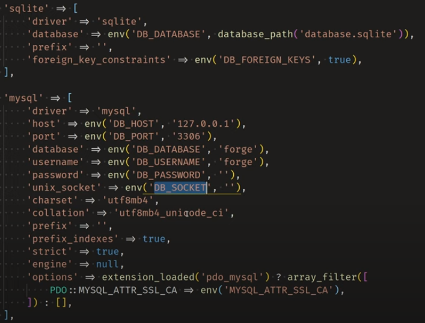

- .env (environment)
  - 環境有哪些
    - local
    - dev
    - qa
    - prod
  - 環境變數：不同的開發環境
    - 對應不同環境的資料庫
  - 為什麼需要環境變數：
    - 設定會散落在各處
    - 方便切換設定
    - env 函數第 2 個參數，預設值
  - 如果沒有環境變數
    - 資安風險
      - 資料庫
    - 沒有環境變數的情況下，如何保證安全(?):
      - 拒絕訪問
      - 不要進入版控
      - 用動態的方式：如 get 網址
  - env() : 取得值

---

- Command

  - `command -h` / `man comand`
    - manual
  - `cat`
    - 顯示全部
  - `less`
    - 可用 /(文字) 來搜尋關鍵字
    - 可以往下捲動
  - `ln`：做鏈接

    - `ln '基地(from)的路徑，需完整路徑' '要連接的檔案的路徑(to)'`
      - 例子：`ln ~/link/MainA.txt AnOtherFolder.txt`
      - `ln ~/xx/xx/path .`
      - `ln ~/xx/xx/a.txt a.txt`
      - `ln ~/xx/xx/a.txt .`
      - 沒有參數就是 hard link
    - `ln -s '基地(from)的路徑，需完整路徑' '要連接的檔案的路徑(to)'`
      - 有 `-s` 的參數就是 soft link

  - `rm`：砍掉文件
  - `ls`：顯示文件

    - `l`，有的 shell 可以看出連結提示

      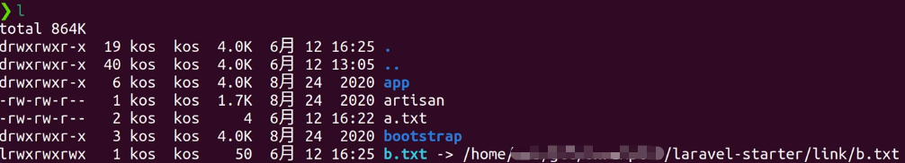

    - `ls`: 顯示文件 （不包括隱藏檔）

      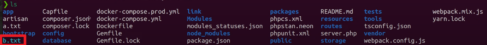

      - hard link 會被視為普通的檔案

    - `ls -a` : 顯示所有文件 （包括隱藏檔）
    - `ls -al`: 顯示所有文件 + 文件的 information
    - `ls -alt`: 顯示所有文件並以時間排序

  - `grep`:全文檢索 | 特殊字須用開關引號
    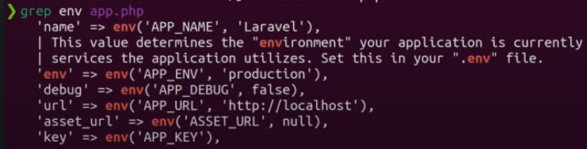
    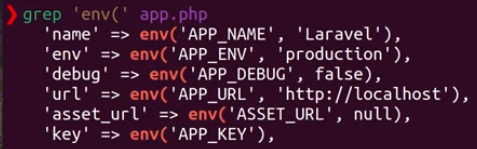

    - `grep '字符' 文件`
      - 整句會出現
      - 例子: `grep 'env(' app.php`
      - Output: 'name' => env(....
    - `grep -o '字符' 文件`

      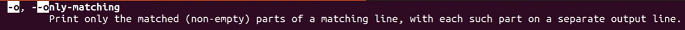

      - o = only
      - 只有搜尋的文字會出現
      - 例子: `grep -o 'env(' app.php`
      - Output: env(

    - grep -o '字符' \*文件
      - 在文件名稱加上\*
      - 符合條件的文件名稱 + 所有 filename 的結尾是 s 的文件裡有 env 的都會出現
      - 例子: `grep -o 'env(' \*s.php`
      - Output: filessystems.php:env(
        systems.pho:env(
    - `grep -oh '字符' \*文件`

      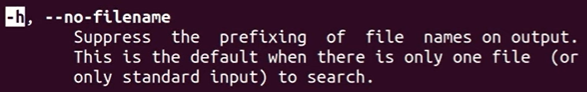

      - 加上 h，不展示文件名

        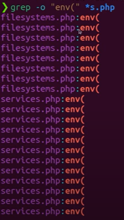
        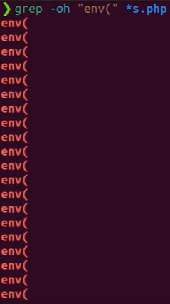

      - 所有 filename 的結尾是 s 的文件裡有 env 的都會出現
      - 例子: `grep -oh 'env(' *s.php`
      - Output: env(
        env(

    - `grep -R '字符' *文件`

      - 遞歸讀取每個目錄下的所有文件。 與 -r 不同，遵循所有符號鏈接

    - `grep -P '字符' *文件`

      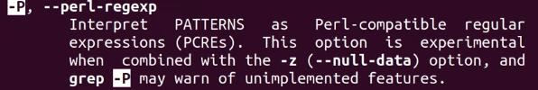

---

- 在 Linux 裡的環境變數
  - Get 環境變數的地方的優先順序：local > global >env 檔
  - 建立系統層的環境變數 （Global）
    - 【創建變數】export [環境變數名稱] = [名字]
      - 例子：export ABC = Kos
    - 【印出變數】使用 env | grep [環境變數名稱]
      - 例子：ABC = Kos
  - 建立程式層的環境變數 （Local）
    - [環境變數名稱]=[名字] php artisan tinker
      - 例子：YYY = Kos php artisan tinker
      - 暫時性的環境變數，只有在程式裡使用
  - 顯示環境變數的名字
    - echo $環境變數名稱
      - 例子：echo $YYY
      - Output：Kos
  - 用 Bash 更改環境變數
    - 若沒權限，可使用以下其中一個 command，但比較推薦第二個方法
      - 使用 sudo
        - sudo --preserver-env=ABC bash ./run.sh
      - 更改文件權限
        - chmod +x run.sh (!!!)
- Link

  - 1 對 1，實線硬連結，虛線軟連結

    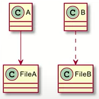

  - 多對 1

    - 軟連結全砍，檔案還在
    - 硬連結砍 1 個，檔案還在
    - 硬連結全砍，檔案不在

    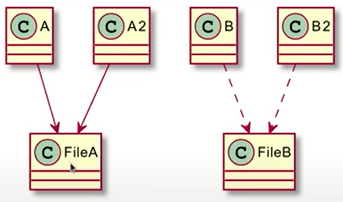

  - [Symbolic Link](https://en.wikipedia.org/wiki/Symbolic_link)
    - 或稱為 Soft link，如 Windows 的捷徑
    - 可檔案或目錄
    - 特性：被砍掉的話那些有鏈接的文件依舊會保存
    - 砍連結，檔案還在
    - 砍檔案，連結還在，顯示找不到檔案
  - Hard Link
    - 只能針對檔案
    - 實務上較不常用
    - 特性：原文件和被連接的文件可謂一體，但刪除哪一個都不會相互影響，最後留下來的文件可“獨占”文件內容
    - 實體上共用，不分彼此，不論砍掉檔案或連結，最後留下的會變成檔案

---

- Regular expression

  - . = 任何字
  - \* = 多個
  - ? = 貪婪模式
  - ( )= Group

---

- 編輯技巧

  - Tab
  - 一次針對大段文字往右移一個 Tab
    - 段落全選 + Tab
  - 左移一個 Tab
    - 段落全選 + Shift + Tab
  - ctrl + ]
  - ctrl + [

- vscode 取出想要的字串

  ```php
  'name' => env('APP_NAME', 'Laravel'),
  'env' => env('APP_ENV', 'production'),
  'debug' => (bool) env('APP_DEBUG', false),
  'url' => env('APP_URL', 'http://localhost'),
  'asset_url' => env('ASSET_URL', null),
  'key' => env('APP_KEY'),
  ```

  - 找出 pattern，`env(`
  - ctrl + →

---

- 學習優先權
  - 佔的比例比較大
    - 考試時，某個章節內容比較多東西，就先去讀
  - 即將會用到的優先學
    - Dependency Tree，依賴的樹狀結構
    - 避免焦點發散
  - 很常用的
- 筆記方法
  - 盡量用數位的方式
  - 全文檢索
  - 標籤
  - 樹狀結構（圖書館分類學、維基百科）
  - 支援 Archive
  - Notion
  - 建立知識地圖

---

- VS Code Plugin
  - [Gist](https://marketplace.visualstudio.com/items?itemName=kenhowardpdx.vscode-gist)
    - create profile
      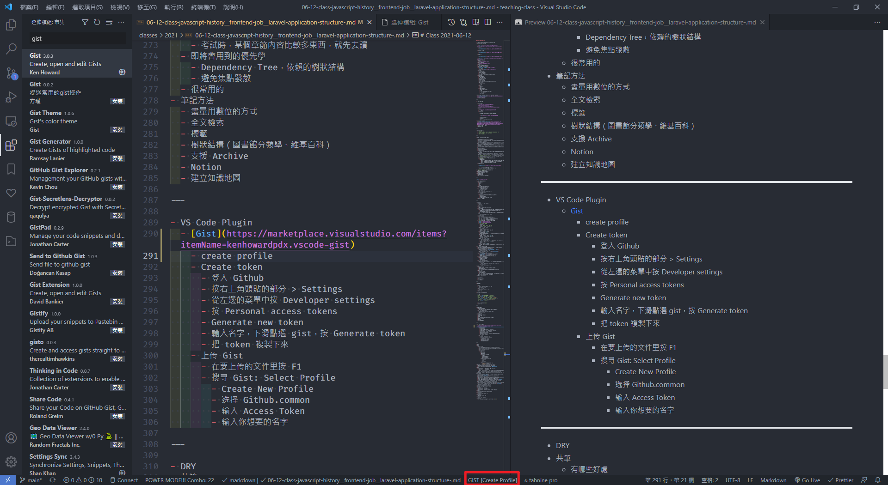
      - 不同的 profile 對應不同用途
    - Create token
      - 登入 Github
      - 按右上角頭貼的部分 > Settings
      - 從左邊的菜單中按 Developer settings
      - 按 Personal access tokens
      - Generate new token
      - 輸入名字，下滑點選 gist，按 Generate token
      - 把 token 複製下來
    - 上传 Gist
      - 在要上传的文件里按 F1
      - 搜寻 Gist: Select Profile
        - Create New Profile
        - 选择 Github.common
        - 输入 Access Token
        - 输入你想要的名字

---

- [DRY](https://www.google.com/search?q=dry+%E5%8E%9F%E5%89%87&rlz=1C1SQJL_zh-TW&oq=dry+%E5%8E%9F&aqs=chrome.1.69i57j0l2j0i30l2j0i8i30l2.7201j0j1&sourceid=chrome&ie=UTF-8)
- 共筆
  - 有哪些好處
    - 訓練要快速理解別人講的，而且要可以馬上做記錄
    - 如果主講人，能即時看到，如果記錄不夠精準，還可以立即回饋
    - 不用事後整理，活在當下
    - 團隊合作精神
      - 一起有貢獻
      - 定義
        - 共同目標
        - 時間因素
        - 報告自己狀況/進度
          - 優先權
          - 清楚、簡短扼要
          - 可以讓別人理解
        - 根據其他人的狀況來調整
          - 調整自己
          - 溝通
          - 調整別人
        - 互補
          - 能力，每個人的特質不一樣
          - **時間**，影分身

---

- Docker,在 Laravel Project 創建新 module

  - 先進入 `docker-compose exec php7 bash`
  - 打上 `php artisan module:make [Modulename]`

    

- DNS
  - /etc/hosts/ = 可設置本機 DNS 相關資訊
    - 127.0.0.1 = Localhost
    - 可添加： 127.0.0.1 = www.google.com，那ping的時候就會ping localhost，這個情況是為了模擬 production 環境
- App 如上所說 就是 application folder，然後 source code 都是 under 這裡
  - Console:laravel 需要到的 artisan commands; php artisan make:command[CommandName]
  - Event: 儲存 event 的 directory； php artisan make:event [event name]
  - Exceptions: 你有特定想要處理的異常 就可以更改 handler class
  - http: 程式處理 request 的 logic 幾乎在這裡
  - jobs: 待處理的活動 ； php artisan make:job [JobName]
  - Listeners:怎麼處理 event ； exception php artisan make:listener [listener name] --event=Event
  - policies： handle authorization 的， determine 用戶能否執行某些 action ； php artisan:make policy [Policyname]
  - providers:處理 event 的源頭
- Bootstrap ： bootstrap script
- Config: configuration 的 file
- Database:
  - seeds: unit testing
  - migrations: migrate db
  - factories： generate large number of ata
- public:
  - initialize laravel application
- resources:
  - styling (js, css....)
- storage：
  - 需要的 files/ log
- tests：
  - unit test 的文件
- vendor：
  - to include third party libraries (**\***)
