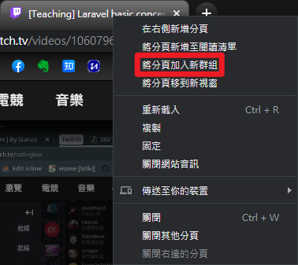

# Class2021-06-19

## Agenda

### Introduce Github Project

### HackMD Introduction

- [HackMD 使用教學](https://hackmd.io/c/tutorials-tw/%2Fs%2Ftutorials-tw)

### chrome tab group



### Basic features

- Modes
  - Edit
    - Use Markdown syntax
    - Component Icons
    - Settings
      - Spaces: 2
      - Editor: SUBLIME
  - Preview
    - Table of content
    - Comments
  - Both
- Menu
  - Sync To Github
  - Template
  - Export
  - Import
  - Download
- Permission
  - Read
  - Write
  - Roles
    - Owners
    - Sign-in Users
    - Everyone

### Teaching Laravel

- Laravel - [Configuration](https://www.tutorialspoint.com/laravel/laravel_configuration.htm)
  - env-helper
- [Helper function](https://cs.brown.edu/courses/csci0111/fall2018/lectures/helper-functions.html)
  - create helper functions to "clean up your code"
  - [clean code(無瑕的程式碼)](https://www.tenlong.com.tw/products/9789862017050)
  - Definition: useful and reusable function
  - Alias: util function, util class
    - Java
    - Ruby
    - PHP
  - 對象: e.x String, Array
  - 特性: Global, Stateless
    - [Laravel helpers](https://laravel.com/docs/8.x/helpers#introduction)
  - 注意: 不應該太多
  - 技巧: 針對非通用對象時，可以使用 static method
- Stateful v.s. Stateless
  - Stateful: session
    - e.x. create_post(text)
  - Stateless: no session
    - e.x. create_post(1, text)
  - Stateless 好擴充
    - load balance
    - sticky session
- Example of Refactoring
  - snmp
    - requirements
      - 要能透過 snmp 取得 server 狀態
      - 要能根據不同情況決定是否要 alert
      - alert 要能夠發訊息給某些人
        - 只寫死某些人要能收到
      - 有哪些 table
        - 有哪些欄位
          - 溫度
          - ip
  - 問題
    - 所有程式都寫在 controller
      - 分層 Layering (水平、垂直)
        - Service
        - Repository
        - [程式架構 水平 垂直](https://www.google.com/search?q=%E7%A8%8B%E5%BC%8F%E6%9E%B6%E6%A7%8B+%E6%B0%B4%E5%B9%B3+%E5%9E%82%E7%9B%B4&sxsrf=ALeKk01odrYbiQEdluO-zzvLpaAPYpjzUQ%3A1624890001410&ei=kdrZYN3NGI-mmAWN17CoBQ&oq=%E7%A8%8B%E5%BC%8F%E6%9E%B6%E6%A7%8B+%E6%B0%B4%E5%B9%B3+&gs_lcp=Cgdnd3Mtd2l6EAMYADIFCCEQoAEyBQghEKABOgUIABCwAzoLCAAQsAMQCBAKEB46BAgjECc6AggAOgUIABCxAzoICAAQsQMQgwE6BwgAELEDEEM6BAgAEEM6BggAEAQQHjoICAAQBRAEEB46BAgAEB46BggAEAUQHjoFCAAQzQJKBAhBGAFQ9OIMWJakDWC1sQ1oAXAAeACAAbUBiAH9DZIBBDI0LjKYAQCgAQGqAQdnd3Mtd2l6yAEDwAEB&sclient=gws-wiz)
      - Model

### 前後端分離

- RESTful api
- JWT
- [cookie and session](https://vicxu.medium.com/authentication-%E9%82%A3%E4%BA%9B%E5%B0%8F%E4%BA%8B%E4%B8%8A%E9%9B%86-cookie-%E8%88%87-session-%E4%BB%8B%E7%B4%B9-1da2d413afa2)
- [cookie, session 與 jwt-token](https://medium.com/@paulyang1234/cookie-session-%E8%88%87-jwt-token-%E5%AE%89%E5%85%A8%E6%80%A7%E5%95%8F%E9%A1%8C-8945a8a579ac)
- [認識 Cookie、Session、Token 與 JWT](https://blog.yyisyou.tw/5d272c64/)
- [在 Laravel 實現自動 Refresh JWT 機制](https://blog.albert-chen.com/laravel-auto-refresh-jwt/)
- [Laravel Policies](https://laravel.com/docs/8.x/authorization#creating-policies)
- [Laravel-permission](https://spatie.be/docs/laravel-permission/v4/introduction)

#### 做出 credit

### Git

- remote
  - 可以放多個 remote, e.x.
    - origin
    - upstream
- command

  - `git remote`: 列出基本的 remote name
  - `git remote -v`: 詳細列出 remote url
  - `git remote show [remote name]`: 可以看到完整的 remote 資訊

    ```bash
    * remote origin
    Fetch URL: git@github.com:koshuang/teaching-class.git
    Push  URL: git@github.com:koshuang/teaching-class.git
    HEAD branch: main
    Remote branch:
    main tracked
    Local branch configured for 'git pull':
    main rebases onto remote main
    Local ref configured for 'git push':
    main pushes to main (up to date)
    ```

  - `git remote add [name] [git url]`: 新增一個 remote
  - `git pull [name] [branch name]`
    - `git pull upstream main`
  - `git rebase -i [版號]`
    - 注意版號前後順序
    - fixup
    - `git push -f`

- config

  - set up 'git pull' to rebase instead of merge

    ```bash
    [branch]
    # set up 'git pull' to rebase instead of merge
    autosetuprebase = always
    ```

## Todo

- Introduce RESTful
- How to do refactoring
- Modeling
- Introduce must read books
  - Clean Code
  - Refactoring

## References

## Time code

- [00:12:58](https://www.twitch.tv/videos/1060796155?t=0h12m58s) github projects
- [01:00:43](https://www.twitch.tv/videos/1060796155?t=1h0m43s) HackMD
- [01:44:34](https://www.twitch.tv/videos/1060796155?t=1h44m34s) chrome tab group
- [01:58:48](https://www.twitch.tv/videos/1060796155?t=1h58m48s) Laravel config
- [02:03:46](https://www.twitch.tv/videos/1060796155?t=2h3m46s) helper function
- [02:30:43](https://www.twitch.tv/videos/1060796155?t=2h30m43s) 狀態
- [02:36:40](https://www.twitch.tv/videos/1060796155?t=2h36m40s) Stateless
- [02:47:48](https://www.twitch.tv/videos/1060796155?t=2h47m38s) helper function, static function,instance function
- [03:23:12](https://www.twitch.tv/videos/1060796155?t=3h23m12s) How to refactoring
- [04:12:53](https://www.twitch.tv/videos/1060796155?t=4h12m53s) 前後端分離
- [05:41:09](https://www.twitch.tv/videos/1060796155?t=5h41m9s) github pull request
